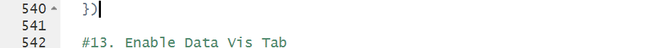
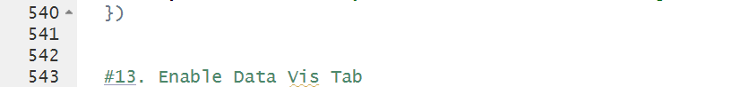
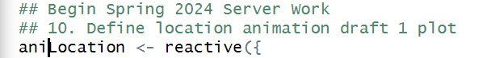
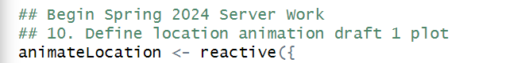

# 10-13 Code Review
By Kelton Watts

|Standard   | Feedback |
|-----------|----------|
Functions, Methods, and Size | No problems.
Formatting, layout, and style | No problems.
White Space | No problems.
Block and Statement style guidelines | No problems.
Declaration Style Guidelines | No problems.
Commenting Style Guidelines | Block 13 had only 1 preceding blank line instead of 2. See figure 1 and 2.
Identifier naming conventions | ani is not as clear as animate as a name. See figure 3 and 4.
Defensive programming | No problems.
Error Handling | No problems.

