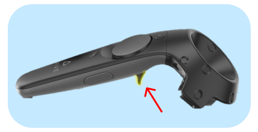
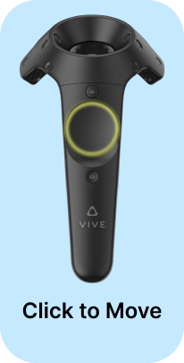
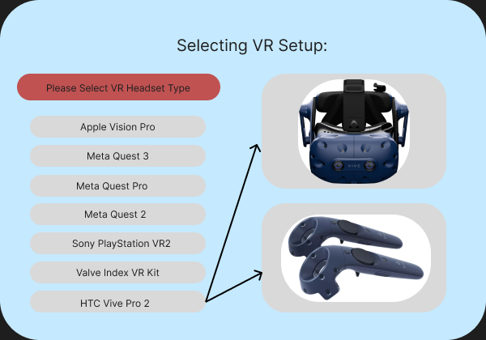
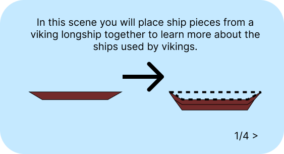
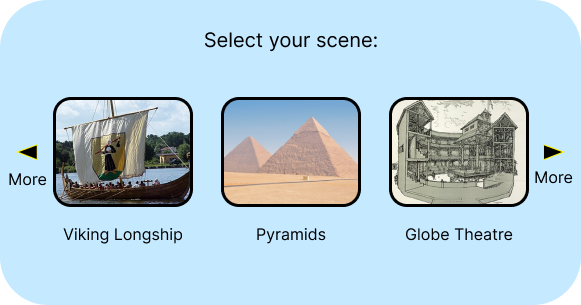
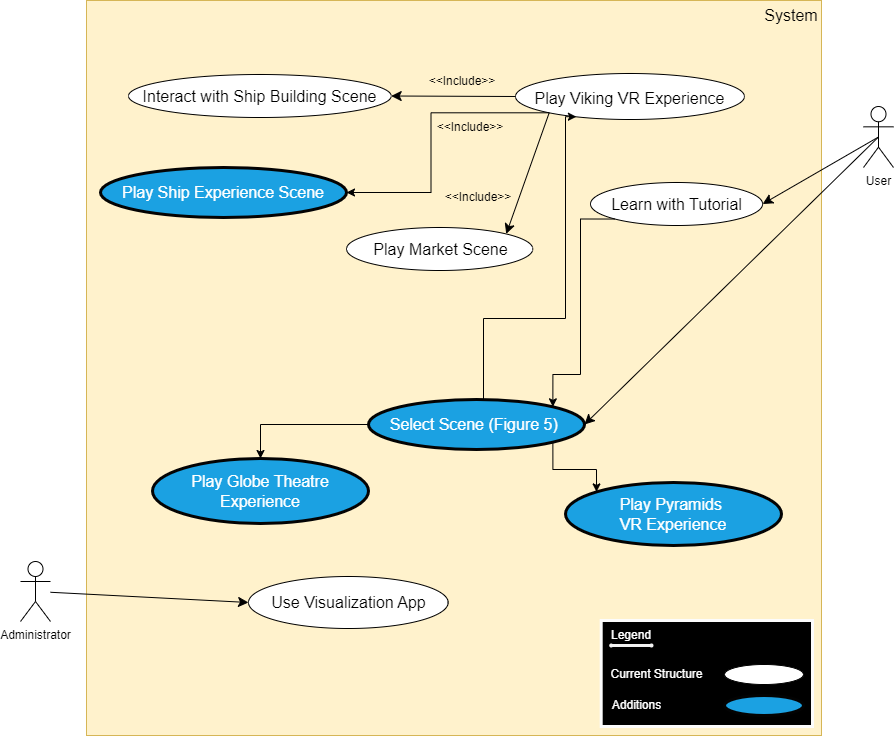
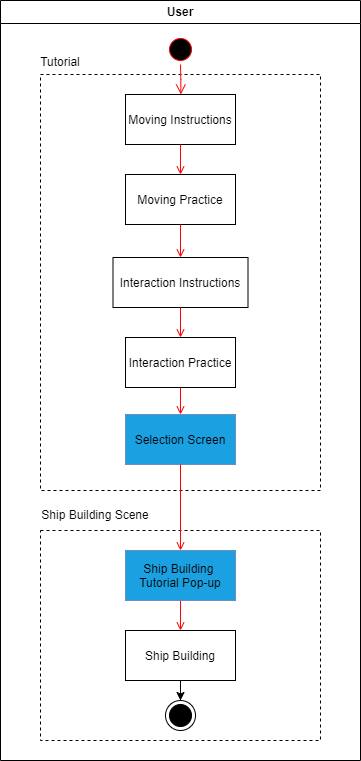
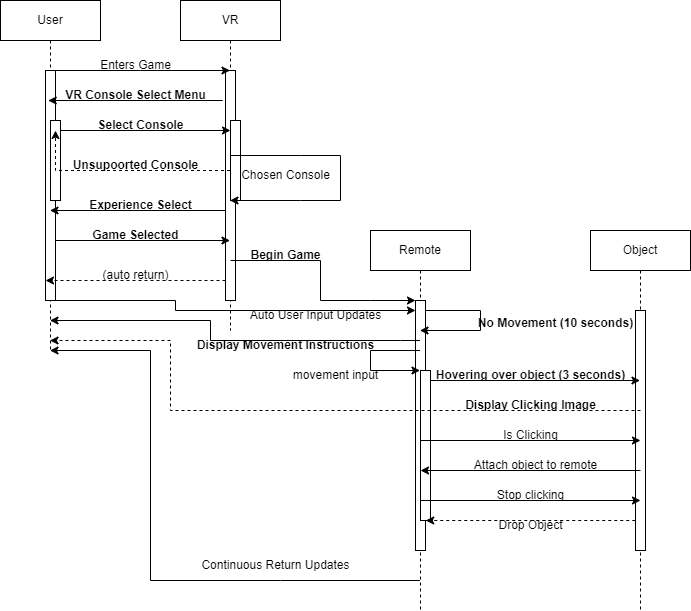

---
output:
  html_document: default
  pdf_document: default
---
# Project Future Vision

## Table of Contents

- [Project Future Vision](#project-future-vision)
  - [Table of Contents](#table-of-contents)
  - [Introduction](#introduction)
  - [Implementation](#implementation)
    - [Tutorial](#tutorial)
    - [Controller Use Mechanics](#controller-use-mechanics)
    - [Ship Building Scene](#ship-building-scene)
  - [Extension](#extension)
    - [Improved Learning Experience](#improved-learning-experience)
    - [Framework](#framework)
  - [Application](#application)
  - [UML Diagrams](#uml-diagrams)
    - [Use Case Diagram](#use-case-diagram)
    - [Activity Diagram](#activity-diagram)
    - [Sequence Diagram](#sequence-diagram)
  - [References](#references)

## Introduction

The vision for the Viking Longship Project as seen by the CSC324 Spring Prototype Testers.
This document will be broken up into 3 sections. First the Implementation Section
which will detail how the current implementation of the Tutorial and Viking Longship Scene
could be improved. Second will be the Extension Section which will explain how we see
the Viking Longship Project evolving in future iterations of the project. Finally 
the Application Section will discuss how the Viking Longship Project could impact
current learning and VR experiences of different audiences.
All prototype images represent pop ups that could help the user 
experience as they progress through the scene [1]. Each proposed 
addition will be represented on a set of UML Diagrams in
the UML Diagram Section in order to provide clarity to our ideas.

## Implementation 

### Tutorial

There were parts of the tutorial that did not have clear
instructions for the user. When explaining how to select objects
with the trigger and move with the directional pad, the instructions
explained with a written description how to select or move.
For some individuals the instructions were enough, but for 
some an explanation from a nearby person was required. 
A simple image or two could easily improve the learning 
process of the player. An image such as the one below would
improve tutorial. 

Figure 1: Correct button highlight.

The same problem occurred when learning to pick up objects.
Users sometimes thought they did not need to reach out 
with their hand to the object or did not move close
enough with the directional pad to reach the object. 
More robust instructions with a sequence of images 
would help users learn easier and quicker. 

Furthermore, the end of the tutorial features a green pillar that 
the user must walk inside of to progress to the ship building
experience. This was very unclear without any instructions.
A screen to select with the trigger or a sign telling the 
user to enter the pillar to advance would improve the end of 
the tutorial.

Additionally, having timed instructions that appear when the user hasn't moved to the next section, clicked on an informational description, ar grabbed at an object would be helpful. The benefit of this is that the user will have constant reminders of how to play that do not require pausing the learning experience. Implementing this would mimic common VR and game practice in industry today. It is up to the developer's discretion on whether or not to implement this in further aspects of the game such as the ship building scene, but it is recommended to have this available in the tutorial. 

### Controller Use Mechanics

Throughout play testing of the Ship Building scene 
we constantly forgot which button was used to
interact with objects in the game. A simple 
image reminding the user which button to click would 
make remembering how to interact with the scene easier
and allow for more focus on content rather than the 
mechanics of the scene. The image could appear after 
the controller is held on an interactable object (new piece,
menu, etc.) for a certain amount of time so that new users 
would get help but experienced users are not pestered with instructions. Consider the following image as an example 
instruction that could appear after 3 seconds of no movement during the tutorial movement section.
(an arbitrary time for the sake of purpose).

Figure 2: Controller reminder visual.

Additionally, this could be paired with an accurate visual of the controller the user is using. The above example uses the Vive VR controller. Given that there are a multitude of potential VR headsets that could be used, a possible menu for the user to select from would be one possible implementation. 

Figure 3: VR setup. 

Each of the proposed additions to the VR experience are shown in Figure 8, the UML sequence diagram.

### Ship Building Scene

The entire Viking Longship Project features a 
tutorial, but the ship building scene itself 
has no instructions. The user must figure out the purpose
and set of activities available in the scene. 
Without the help from Oscar Scherer and a general 
explanation our team would not have figured out 
how exactly to advance. Even those who could have 
figured the scene out spent more time making sense of 
how the scene works instead of learning the actual information.
To direct the focus of the players to learning 
the information on each piece, a brief tutorial would 
remove the need to focus on how the scene itself works. 

This tutorial would ideally be done by walking the user through all the possible interactions. If the user were given guided interactive instructions that prompt an adjustment of the ship height, movement to the movable piece, a direction to interact with the information pane, and then visualizations showing how to manipulate the piece, the user would be well equipped to maximize the learning potential of the Viking Longship. Consider Figure 7 for more information on the game flow and the following popup as you enter the scene with multiple pages of instructions:

Figure 4: Ship building scene instructions pop-up.

## Extension

We view the nature of the Viking Longship Project as a
proof of concept. The point of this project is to showcase
what can be created in VR to promote learning. This 
purpose yields 2 main directions the project can extend: 
what more can be created to improve the learning experience,
and how can this project provide a framework for future projects
of similar learning purpose. The following subsections will address these directions. 

### Improved Learning Experience

Since the purpose of VR is to immerse the user in the chosen
program, a scene where the player uses the boat in an ocean type
scene could help the player understand the experience of the 
Vikings in their ships in the given time period. A movie type
scene would be less interactive than the other scenes created,
but the simulation would transport players closer to the 
experiences of the individuals of the time. No other mode 
of learning allows people to take a step into the experiences 
of those in history. Understanding what it could have been 
like in the past would allow players to better appreciate 
the information presented and in turn improving the learning
experience.

### Framework

The success of the Viking Longship Project as a proof of 
concept lays out a method to presenting other historical 
information. The tutorial and game mechanics for example
are not specific to viking ships, but could be used for 
other historic VR experiences. From the current Viking 
Longship Project a framework could be developed to allow 
historians with less technical knowledge to create similar
VR experiences. 

The difference between the ship building scene and a potential scene building the Pyramids of Egypt 
would only be the pieces involved and the information files
which appear when a piece is picked up. A framework system that 
takes a set of files detailing the piece dimensions, piece order,
and piece information could allow for more historic VR 
experiences to be created. The data visualizations could also 
be generalized for a framework without trouble. This way 
administrators could easily evaluate their own project 
thanks to the work done on the Viking Longship Project.

## Application

The application of this VR learning experience, which targets with historical accuracy the Viking culture and ship-building process, would best be used as an interactive museum-esc game. Through playing, the aspect that is particularly interesting is the accuracy of the ship building task. Given the importance of this to the viking culture, it is imperative to relay information in an engaging way. 

Since we find the importance of this project so high to viking
culture, limiting the scope of historical VR projects to 
only the vikings makes no sense. Given the framework 
extension described previously, the same style of project
could be used on numerous historical topics. The Pyramids of 
Egypt, the first airplane, and the Eiffel Tower could all be built similarly to the ship building scene. 
The Globe Theatre, the Parthenon, and a Roman aqueduct could be presented like the viking banquet hall scene. 

Each of these scenes would enhance learning in their 
respective historical areas. This is done two-fold. 
First through the actual experience of each scene, and second via the informative descriptions of each scene. 

Given this, the targeted audience for the potential historical VR scenes are both visual and hands on learners. This engagement style is grounded in the use of imagery and personal experience to facilitate memory and learning. The immersive scenes' learning experience gives students access to both styles of learning through its task or experience oriented nature and complex progressive imagery. Due to the excellent opportunities 
for learning, the collection of scenes could be combined into 
a single program to compliment textbooks. Figure 6 and 7 show the potential option for how the menu would be added to the experience. An example menu is shown below.

Figure 5: Scene select pop-up. 
Note all images were taken from their respective wikipedia entries [2][3][4].

It will be common for students to interact with aspects of historical VR experiences differently. By also including visuals and descriptions of highlighted aspects of an experience, the creators would be able to provide students with a more engaging learning experience.

The framework created by the potential extension of the 
Viking Longship Project is not limited to history either. 
The framework could be useful for any context where learning is the objective. For example, some schools do not have room for a 
car in a shop type setting. With a ship building type scene however, the students could learn about car engines in a 
hands on and engaging manner. High schools and colleges 
could use VR to educate students on how computers are 
built and function in the same ship building scene style.
The point is the VR framework that could be created by 
the Viking Longship Project could be a versatile tool 
for learning across multiple disciplines.

To summarize, the developers have created an immerse Viking Longship experience that targets students, interested parties, and academics interested in the key aspects of Viking culture. The learning experience created caters to an array of learning styles making it an effective tool for education. From historic 
tools, buildings, and locations long gone from this world 
to current technology and systems, there is great in the 
potential learning systems created from the Viking Longship Project.

## UML Diagrams

### Use Case Diagram

Figure 6: Use Case Diagram. Note all additions are in blue.

The Activity Diagram of the ship building scene is quite simple. The addition of the selection screen and ship building tutorial pop-up would allow for potential scalability with other scenes and an improved ship building experience respectively.

### Activity Diagram

Figure 7: Activity Diagram. Note all additions are in blue.

The addition of the screen select would prepare for scaling into other VR experiences such as the Glove Theatre or Pyramids VR experience (shown in blue). The ship experience scene would be a great addition to the Viking VR experience to allow users to better understand the importance of the ship. 

### Sequence Diagram

Figure 8: Sequence Diagram. Note all proposed additions are bolded.

The UML Sequence Diagram for Future Vision is a design based on the current state of the virtual reality experience with the added implementations of the Future Vision. As can be seen, the framework is split into four phases: the user, the VR, the remote controller, and the objects. Of course, these are not all aspects of VR, rather just the ones that relate to the proposed changes. The first changes come between the user and the VR with the console select interface and the game selection. Then the game moves between the user and the controller. Here there are proposed built-in safeguards added which account for the lack of movement of a player resulting in a pop-up of instructions, as well as a user not clicking on an object, which results in more pop-up instructions. All of this is added in and amongst the already implemented user interface. 

## References

[1] Figma, “Figma: the collaborative interface design tool.,” Figma, 2019. https://www.figma.com

[2] Wikipedia Contributors, “Longship,” Wikipedia, Nov. 25, 2019. https://en.wikipedia.org/wiki/Longship

[3] Wikipedia Contributors, “Wikipedia,” Wikipedia, 2008. https://commons.wikimedia.org/wiki/File:Cairo_pyramids,_Dec_2008_-_59_(bis).jpg#globalusage (accessed May 02, 2024).

[4] Wikipedia Contributors, “Globe Theatre,” Wikipedia, Feb. 26, 2019. https://en.wikipedia.org/wiki/Globe_Theatre

